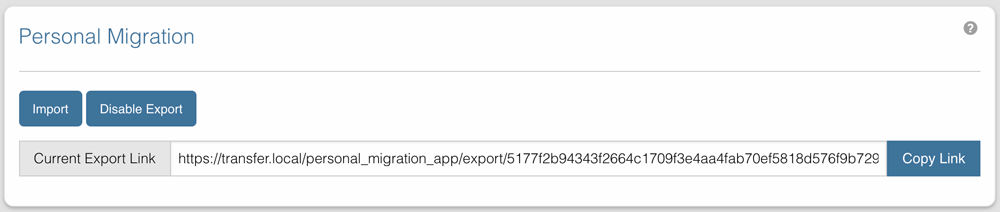
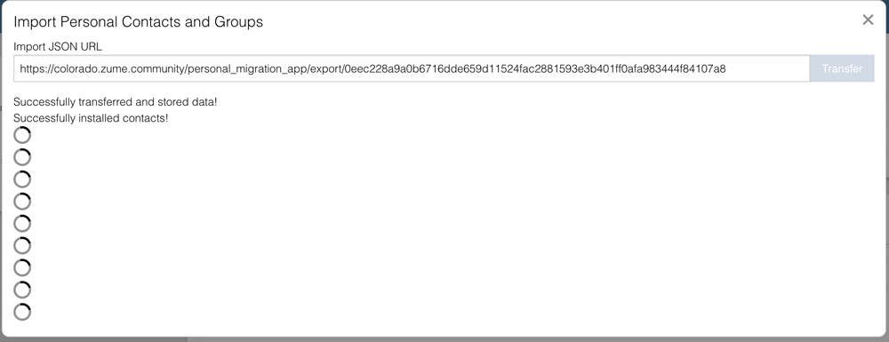

# Disciple.Tools - Personal Migration

Allow users to migrate their contacts and groups to another Disciple.Tools system. This plugin adds a section to the
users settings page and allows them to a personal migration to another system.

## Purpose

For situations where a multiplier is moving their work from one team or system to another team or system.

This plugin supports copying of 2000 contacts and 1000 groups from one system to another. It excludes any contacts labeled as "Access" and
includes all contacts and groups that are shared with the user.

## Usage

#### Will Do

- Gives users power to copy their data between systems
- Copy 2000 contacts and details
- Copy 1000 groups and details
- Copy all associated comments
- Rebuilds generational connections and cross-references
- Imports CSV contacts and groups

#### Will Not Do

- Does not copy contacts labeled "access" unless granted access
- Limited to 2000 contacts per site
- Limited to 1000 groups per site
- Consider CSV for larger lists (but no cross connection supported with CSV)

## Requirements

- Disciple.Tools Theme installed on a Wordpress Server

## Installing

- Install as a standard Disciple.Tools/Wordpress plugin in the system Admin/Plugins area.
- Requires the user role of Administrator.

## Contribution

Contributions welcome. You can report issues and bugs in the
[Issues](https://github.com/DiscipleTools/disciple-tools-personal-migration/issues) section of the repo. You can present ideas
in the [Discussions](https://github.com/DiscipleTools/disciple-tools-personal-migration/discussions) section of the repo. And
code contributions are welcome using the [Pull Request](https://github.com/DiscipleTools/disciple-tools-personal-migration/pulls)
system for git. For a more details on contribution see the
[contribution guidelines](https://github.com/DiscipleTools/disciple-tools-personal-migration/blob/master/CONTRIBUTING.md).

## Screenshots
Import Tile Added to Settings Page

Screen to Import URL and Begin Migration

Processing Page as Records are copied between systems

